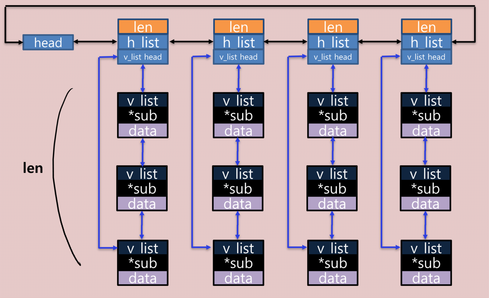

# Assignment Archive for 2020-2 Linux System and its Applications (#52811)

## Resources
- `assignment5` - System call  
- `assignment6` - Kernel Modlue  
- `assignment7` - Kernel Module using APIs of linked list (insert, search, delete)   
- `assignment8` - Kernel Module using APIs of red-black tree (insert, search, delete)  
- `assignment9` - pthread & kthread Module  
- `assignment10` - Atomic instruction & three locking mechanism (spinlock, mutex, RW semaphore)  
- `team_proj`
  - new kernel data structure
  
